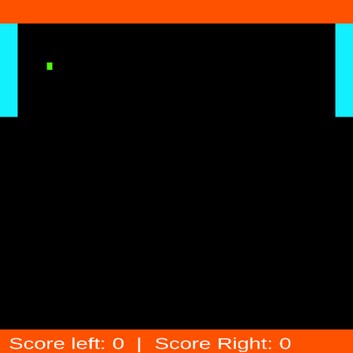

<div align="center">

<!-- TOC --><a name="nebulite-game-engine"></a>
# Nebulite Game Engine

[](https://github.com/lbastigk)
[](LICENSE.md)
[]()
[]()


<strong>A data‑driven 2D engine + declarative DSL for rapid experimentation with object interactions and emergent mechanics.</strong>

<p align="center">
  
  
</p>

<p align="center">
  
  
</p>

</div>

<!-- TOC start (generated with https://github.com/derlin/bitdowntoc) -->

- [Overview](#overview)
- [Quick Start](#quick-start)
- [Core Concepts](#core-concepts)
  * [Expression System](#expression-system)
  * [Invoke System](#invoke-system)
  * [Runtime Modes](#runtime-modes)
- [Platform Support & Dependencies](#platform-support-dependencies)
- [Testing](#testing)
- [Languages](#languages)
  * [Nebulite Script](#nebulite-script)
  * [Nebulite Logic](#nebulite-logic)
- [Contributing](#contributing)
- [Learn More](#learn-more)
- [License](#license)

<!-- TOC end -->

<!-- TOC --><a name="overview"></a>
## Overview

**Nebulite** is a C++23 2D game engine with a custom Domain-Specific Language (DSL) as well as JSON/JSONC-defined objects
such as Rulesets, RenderObjects and Environments.
It focuses on:
- Declarative composition of rulesets (gravity, AI, triggers) via small JSON fragments
- Flexible SELF / OTHER / GLOBAL context interaction model with local and broadcasted events
- Optimized runtime expression evaluation
- Headless + interactive execution modes
- Separation of concerns using Domains and DomainModules for encapsulated logic
- Scriptable commands via Nebulite Script (.nebs) files

<!-- TOC --><a name="quick-start"></a>
## Quick Start

1. Clone & enter repo
```bash
  git clone https://github.com/lbastigk/Nebulite && cd Nebulite
```
2. Install dependencies, if necessary
```bash
  make install-deps
```
3. Build binaries
```bash
  # Linux
  make linux-debug linux-release linux-coverage
```
```bash
  # Mac
  make macos-debug macos-release
```
```bash
  # Windows
  make windows-debug windows-release
```
4. Download Resources
```bash
  make resources
```
5. Run any script:
  ```bash
  ./bin/Nebulite task TaskFiles/Benchmarks/gravity_unlimited.nebs 
  ```
6. Open console (press `tab`) and type `help` for interactive commands.

<!-- TOC --><a name="core-concepts"></a>
## Core Concepts

<!-- TOC --><a name="expression-system"></a>
### Expression System
Access and manipulate data using variables `{...}` inside and outside mathematical expressions `$(...)`:

**Variable Contexts:**

| Variable                | Description                        |
|-------------------------|------------------------------------|
| `{self.*}`              | the object broadcasting logic      |
| `{other.*}`             | objects listening to the broadcast |
| `{global.*}`            | shared engine state                |
| `{file.json:key.path}`  | external read-only JSON files      |
| `{global.{self.id}}`    | nested resolution (multiresolve).  |

**Mathematical Expressions:**

| Example                  | Description                                   |
|--------------------------|-----------------------------------------------|
| `$(1 + 2 * {self.mass})` | arithmetic with variables                     |
| `$(gt({self.hp}, 0))`    | logical operations (gt, lt, eq, and, or, not) |
| `$i(3.14)`               | cast to integer                               |
| `$04i(3.14)`             | cast to integer with formatting               |
| `$10.5f({self.var})`     | cast to float with formatting                 |

retrieved values from JSON documents inside mathematical expressions are auto-casted to double.
Expressions do not offer the ability to operate on non-double values (strings, arrays, objects).

**Value Transformations:**
Nebulite offers transformation functions of JSON values on retrieval.
They do not modify the stored value, only the returned one.
- `{self.arr|length}` - get array length instead of the array
- `{self.arr|map <function>}` - apply function to each array element
- `{self.val|add 5}` - add 5 to value on retrieval
- `{self.val|typeAsString}` - returns the type of the value as string (value, array, object, null)
- `{self.arr|print|at 1}` - Useful for debugging: prints the array to console and returns the element at index 1

**Examples**

Health percentage:
`$3i( {self.health} / {self.maxHealth} * 100 )%`

Inventory size:
`The player has {self.inventory|length} items.`

Sum of two inventories:
`You will have $i({self.inventory|length} + {other.inventory|length}) items after trade.`

<!-- TOC --><a name="invoke-system"></a>
### Invoke System
Define object interactions via JSON rulesets:
```jsonc
{
  "topic": "gravity",         // Broadcast channel
  "logicalArg": "1",          // Condition to execute
  "exprs": [                  // Modify values
    "other.physics.aY += $({global.physics.G} * {self.physics.mass})"
  ],
  "functioncalls_global": [], // Commands to parse on domain GlobalSpace
  "functioncalls_self": [],   // Commands to parse on domain RenderObject, self
  "functioncalls_other": []   // Commands to parse on domain RenderObject, other
}
```
Rulesets are either local (topic empty) or global (specific topic name).
This allows for inter-object communication via broadcasting and inner-object logic handling.
- hitbox collisions
- area triggers
- velocity integration
- AI decision-making
- custom events

The expressions given are evaluated in the context of
- the broadcasting object (`self`)
- the listening object (`other`)
- the global engine state (`global`)

Note that the vector `exprs` holds assignments as
`<context>.<key> <assignment-operator> <expression>`,
which modify values in their respective JSON documents.
Currently, all assignment operators support only numerical or string values.
Complex types (arrays, objects) cannot be assigned or modified via expressions,
only overwritten by numerical or string literals.
Supported assignment operators:
- `=`  : direct assignment (cast to either double or string, depending on expression)
- `+=` : addition assignment (cast to double)
- `*=` : multiplication assignment (cast to double)
- `|=` : Concatenation assignment (cast to string)

The function calls are parsed and executed in their respective domains after expression evaluation.

<!-- TOC --><a name="runtime-modes"></a>
### Runtime Modes
- **Interactive**: Press `tab` for live console
- **Task Files**: `./bin/Nebulite task script.nebs`
- **Headless**: `--headless` for automation/testing
- **CLI**: `./bin/Nebulite 'command ; chain'`

<!-- TOC --><a name="platform-support-dependencies"></a>
## Platform Support & Dependencies

**Platforms**:
- Linux (native)
- Windows (cross-compiled via MinGW-w64)
- MacOS

**Requirements**:
- CMake 3.16+
- C++23 compiler
- Python 3.8+ (for testing and mock asset creation)

**Dependencies**
- `SDL2`, `SDL_ttf`, `SDL_image` - rendering and input
- `rapidJSON` - JSON parsing
- `abseil` - fast hash maps
- `tinyexpr` - expression evaluation

<!-- TOC --><a name="testing"></a>
## Testing

Run validation and tests:
```bash
python Scripts/TestingSuite.py --stop --verbose
```

<!-- TOC --><a name="languages"></a>
## Languages

<!-- TOC --><a name="nebulite-script"></a>
### Nebulite Script

The `.nebs` *(Nebulite Script)* language is used for parsing commands in different domains.

Nebulite includes a VSCode language extension in `./Languages/nebulite-script-vscode/`.
The extension offers proper syntax highlight for:
- available functions
- variables
- comments
- print-strings (everything after echo/error : meaning it's printed to the command line)

Language extensions for other editors may be added in the future.

Run `build-and-install.sh` inside its directory for installation.

<!-- TOC --><a name="nebulite-logic"></a>
### Nebulite Logic

The `.nebl` *(Nebulite Logic)* language is a work in progress and not yet usable.

<!-- TOC --><a name="contributing"></a>
## Contributing

Contributions welcome. Quick start:
1. Fork & create feature branch (`feature/<short-desc>`)
2. Run install + build + tests
3. Add/update invokes or DSL features with tests / demo TaskFile
4. Open PR referencing related roadmap item or issue

See full details in [CONTRIBUTING.md](CONTRIBUTING.md).

<!-- TOC --><a name="learn-more"></a>
## Learn More

- **Tutorials & Examples**: [Nebulite_Examples](https://github.com/lbastigk/Nebulite_Examples) -
  hands-on tutorials and sample projects
- **Glossary**: [./doc/Glossary.md](./doc/Glossary.md) -
  definitions of key terms and concepts
- **Command Reference**: [./doc/Commands.md](./doc/Commands.md) -
  comprehensive documentation of all available commands for both GlobalSpace and RenderObject domains
  as well as all JSON-Transformations
  (automatically generated with Scripts/MakeCommandDocumentation.py)

<!-- TOC --><a name="license"></a>
## License

Distributed under the MIT License. See [LICENSE.md](LICENSE.md).
