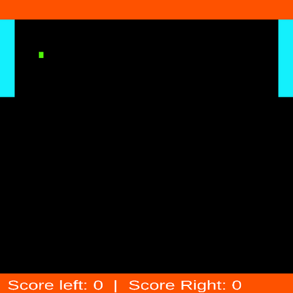
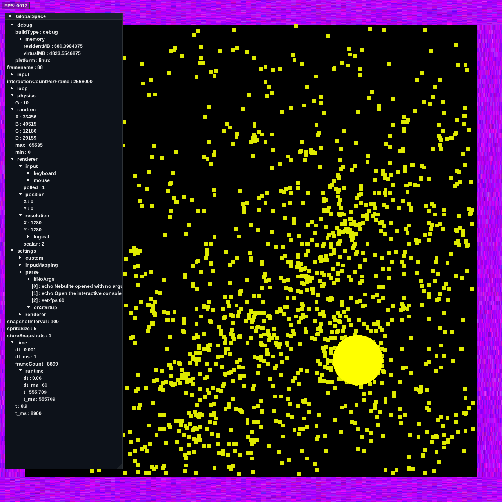
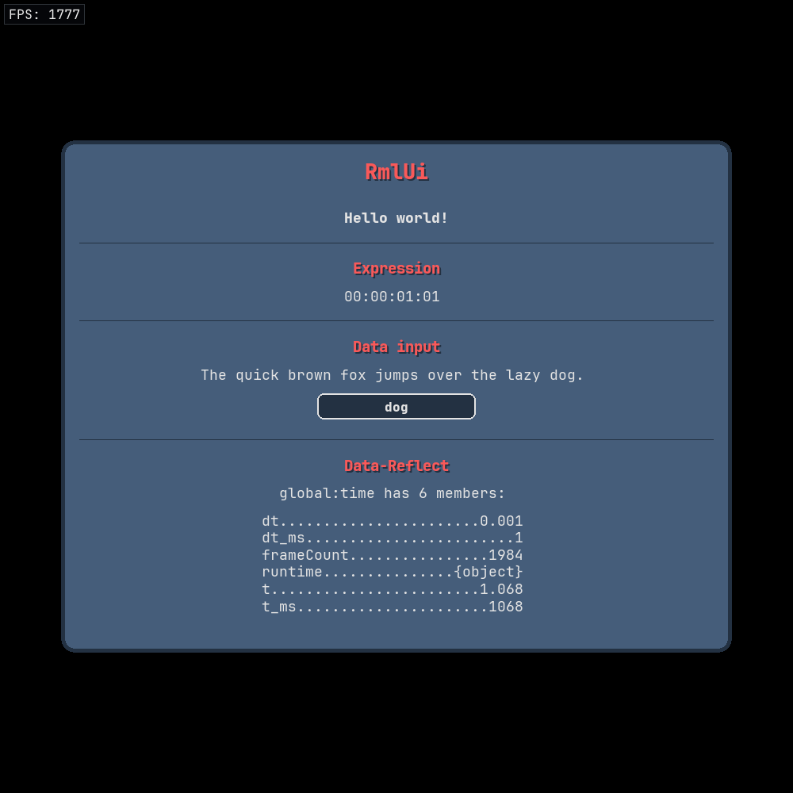
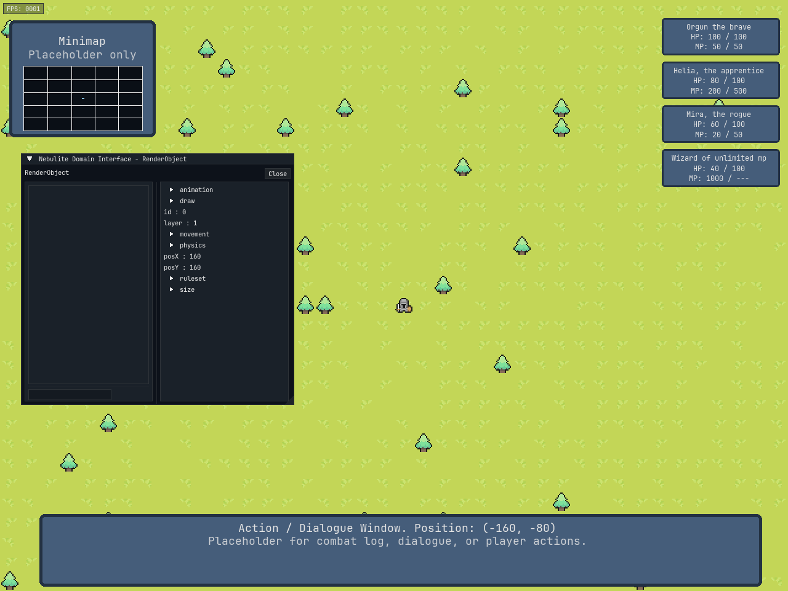

<div align="center">

<!-- TOC --><a name="nebulite-game-engine"></a>
# Nebulite Game Engine

[](https://github.com/lbastigk)
[](LICENSE.md)
[]()
[]()

</div>

<!-- TOC start (generated with https://github.com/derlin/bitdowntoc) -->

- [Overview](#overview)
    * [Core Principles](#core-principles)
    * [Quick Start](#quick-start)
- [Core Concepts](#core-concepts)
    * [Domains & DomainModules](#domains-domainmodules)
    * [Expression System](#expression-system)
    * [Ruleset System](#ruleset-system)
    * [GUI](#gui)
    * [Runtime Modes](#runtime-modes)
- [Platform Support & Dependencies](#platform-support-dependencies)
- [Testing](#testing)
- [Languages](#languages)
    * [Nebulite Script](#nebulite-script)
- [Contributing](#contributing)
- [Learn More](#learn-more)
- [License](#license)

<!-- TOC end -->

<!-- TOC --><a name="overview"></a>
## Overview

**Nebulite** is a modern C++26 2D game engine with flexible data-driven logic and a powerful expression and ruleset system.

Gameplay logic can be defined in two complementary ways:

- **JSON rulesets** — declarative, data-driven, and ideal for experimentation
- **Native C++ rulesets** — hardcoded for maximum performance and full control

Both approaches share the same runtime pipeline and context model,
allowing you to freely mix data-defined and hardcoded behavior within the same project.

<p align="center">
    
    
</p>

<!-- TOC --><a name="core-principles"></a>
### Core Principles

- **Modular Architecture**
    - Domains encapsulate engine subsystems (rendering, global state, entities, etc.)
    - DomainModules provide reusable, isolated functionality (time, console, ruleset management, etc.)
    - Hierarchical domain composition with shared capabilities (Comparable to C++ class inheritance)

- **Scripting & Automation**
    - `.nebs` task files for scripted execution
    - Interactive runtime console
    - Headless mode for testing and automation
    - Chainable CLI command execution
    - easily extendable python testing suite

- **Scoped Data & Access Control**
    - JSON-backed data model
    - No hardcoded variables, you may define your own keys and data structure as you see fit
    - Custom key scopes for controlled data access for encapsulated logic and modularity

- **Context-Driven Interaction**
    - **self** / **other** / **global** context model, with flexible combinations (**all** and **local**)
    - Event broadcasting between objects or just per-object logic handling

- **Seamless UI Integration**
    - ImGui for hardcoded interfaces and tools
    - RmlUI for complex, styled interfaces (menus, HUDs, etc.)
    - Custom RmlUI plugins for direct integration with Nebulite's data model and expression system

<!-- TOC --><a name="quick-start"></a>
### Quick Start

1. Clone & enter repo
```bash
  git clone https://github.com/lbastigk/Nebulite && cd Nebulite
```
Then, run the following commands from the repo root:

2. Install dependencies, if necessary
```bash
  make install-deps
```

This will install all necessary dependencies for Linux via the package manager and git submodules,
as well as a python environment for testing and mock asset creation.
apt, dnf, yum and brew are supported.

See the makefile for details on the installation process and the dependencies installed for each platform.

The installation process, especially for package managers other than dnf, is not fully tested on all platforms, so
**if you notice any issues with the installation process, please tell!**

3. Build binaries

Windows and MacOs support is currently in early stages.
We're actively looking for contributors to help with testing
and improving the build process on these platforms.
Any help is appreciated!

```bash
  # Linux
  make linux-debug linux-release linux-coverage
```
```bash
  # Mac
  make macos-debug macos-release
```
```bash
  # Windows
  make windows-debug windows-release
```
4. Download and generate Resources
```bash
  make resources
```
5. Add the completion scripts to your shell
```bash
  source Scripts/Other/nebuliteCompletion.sh # for bash
```
This is optional but allows for autocompletion of commands in bash.
The interactive console inside Nebulite also supports autocompletion.

6. Run any script:
```bash
./bin/Nebulite task TaskFiles/Benchmarks/gravity_XL.nebs 
```
You should see a window pop up with a large gravity simulation running indefinitely.

More demos and tests can be found in `./TaskFiles/`, including simpler gravity tests
or a pong implementation:

<p align="center">
  
  
</p>

**The general directory structure is as follows:**

- Documentation is located in `./doc/`
- Assets like images, rulesets, RenderObjects are located in `./Resources/`.
- TaskFiles for various Simulations, Tests and Demos are located in `./TaskFiles/`.
- Tests are located in `./Tools/Tests/`
- The main engine code is located in `./include/` and `./src/`, with the entry point in `./src/main.cpp`.

7. Open console (press `^`) and type `help` for interactive commands available for the GlobalSpace domain.

Due to locale settings, some users may need to use a different key for opening the console, such as `°` or the backtick `` ` ``.

<!-- TOC --><a name="core-concepts"></a>
## Core Concepts

See [Glossary.md](./doc/Glossary.md) for further definitions of key terms and concepts.

<!-- TOC --><a name="domains-domainmodules"></a>
### Domains & DomainModules

Domains are modular engine components encapsulating specific functionality such as:
- A renderable entity (`RenderObject` Domain)
- Global engine state (`GlobalSpace` Domain)
- The rendering system (`Renderer` Domain)

Each Domain can initialize DomainModules, which further break down functionality into manageable pieces,
providing update routines and functions for users to call:
- Time management for `GlobalSpace` Domain
- Basic setting and array manipulation via `Common` DomainModule (available to all Domains)
- Console functionality for `Renderer` DomainModule

Each Domain is able to parse string commands that call the respective DomainModules' functions.
These commands may be called by Parent-Domains, the interactive console, or Task Files:
```bash
# Example commands, parsed in the GlobalSpace domain
set myVar 5               # Common function, available in all domains
set-fps 60                # As GlobalSpace is a parent domain of Renderer, it is able to call its functions
always eval echo {self:myVar}
always eval set myVar $({self:myVar} + 1)
wait 100
exit
```

See [Commands.md](./doc/Commands.md) for a full list of available commands for both GlobalSpace and RenderObject domains, including the inherited ones.

Domains may be arranged in a hierarchy, where parent Domains can contain child Domains (Domain-inheritance).
This allows for shared functionality and data between related Domains.

Child Domains share their functions with their parent Domains, allowing for seamless integration and interaction between different parts of the engine.
This way, you may parse commands in a parent Domain that are actually implemented in a child Domain.

Child domains can have access to their parent's full Document Scope or only to a sub-scope, depending on the use case.

Users may define custom scopes for key access restrictions and modular data management.
This allows key sharing inbetween classes and throw exceptions if access is attempted outside the intended scope.

Example for restricted key access:
```cpp
#include "Nebulite/Nebulite.hpp"
#include "Nebulite/Data/Document/JsonScope.hpp"

inline void exampleUsage() {
    // Our Data document
    Nebulite::Data::JSON doc;
    
    // We use two different scopes to demonstrate the access restictions:
    // - physics
    // - time

    // Creating scopes from our document
    Nebulite::Data::JsonScope physicsScope(doc, "physics");
    Nebulite::Data::JsonScope timeScope(doc, "time");

    // Using ScopedKey to access data safely
    Nebulite::Data::ScopedKey const physicsKey("physics");
    Nebulite::Data::ScopedKey const timeKey("time");
    Nebulite::Data::ScopedKey const velocityKey = physicsKey.addMember("v");
    Nebulite::Data::ScopedKey const timeInMsKey = timeKey.addMember("t_ms");

    // Set values
    physicsScope.set<double>(velocityKey, 5.0);
    timeScope.set<double>(timeInMsKey, 100.0);
    
    // Now we can get values using ScopedKey.
    // We "accidentally" try to access timeInMs from the physicsScope instead of the timeScope,
    // which throws an exception, as the key is not in the physicsScope's access scope. 
    // This allows us to catch potential bugs early on.
    // An incorrect acces does NOT return a nullopt/unexpected value, 
    // as false access attempts are considered logic errors
    auto const velocity = physicsScope.get<double>(velocityKey).value_or(0.0); // Success
    auto const timeInMs = physicsScope.get<double>(timeInMsKey).value_or(0.0); // Throws exception

    Nebulite::Global::capture().log.println("Velocity: ", velocity);
    Nebulite::Global::capture().log.println("Time in ms: ", timeInMs);
}
```

Keys are either Defined in a DomainModule or for a specific Domain. Any runtime user-input is assumed to be
at the root of the current scope, so it never throws an exception on access.
The Intent is that the access restrictions apply to the hardcoded logic to enforce encapsulation,
so you can safely assume that any DomainModule with a defined scope:
- accesses the correct member (if you always access based on the root of the provided scope, this is not guaranteed)
- throws an exception if the member is accessed outside its intended scope

<!-- TOC --><a name="expression-system"></a>
### Expression System
Access and manipulate data using variables `{...}` inside and outside mathematical expressions `$(...)`:

**Variable Contexts:**

| Variable               | Description                            |
|------------------------|----------------------------------------|
| `{self:*}`             | the object broadcasting logic          |
| `{other:*}`            | the object listening to the broadcast  |
| `{global:*}`           | shared engine state                    |
| `{local:*}`            | combination of self and other contexts |
| `{all:*}`              | combination of all contexts            |
| `{file.json:key.path}` | external read-only JSON files          |
| `{global:{self:id}}`   | nested resolution (multiresolve).      |
| `{self:arr\|length}`   | return value transformations           |

**Mathematical Expressions:**

| Example                  | Description                                   |
|--------------------------|-----------------------------------------------|
| `$(1 + 2 * {self:mass})` | arithmetic with variables                     |
| `$(gt({self:hp}, 0))`    | logical operations (gt, lt, eq, and, or, not) |
| `$i(3.14)`               | cast to integer                               |
| `$04i(3.14)`             | cast to integer with formatting               |
| `$10.5f({self:var})`     | cast to float with formatting                 |

retrieved values from JSON documents inside mathematical expressions are auto-casted to double.
Expressions do not offer the ability to operate on non-double values (strings, arrays, objects).
If the stored value is non-numerical, the expression system tries to cast it to double,
which results in 0.0 for non-castable values

If the expression is a single variable access, assignments respect the variable's type
and insert them as such, giving you the ability to store complex types like arrays and objects via expressions.

**Return Value Transformations:**
Nebulite offers transformation functions of JSON values on retrieval.
They do not modify the stored value, only the returned one. Examples:
- `{self:arr|length}` - get array length instead of the array
- `{self:arr|map <function>}` - apply function to each array element
- `{self:val|add 5}` - add 5 to value on retrieval
- `{self:val|typeAsString}` - returns the type of the value as string (value, array, object, null)
- `{self:arr|print|at 1}` - Useful for debugging: prints the array to console (no modification of its value)
  and returns the element at index 1
- `{self:str|transform1|transform2|...}` - chain multiple transformations
- `{|transform1|transform2|...}` - start with empty value and apply transformations

See [Commands.md](./doc/Commands.md) for a full list of available transformations.

**Usage Examples**

Health percentage:
`$3i( {self:health} / max(1,{self:maxHealth}) * 100 )%`

Inventory size:
`The player has {self:inventory|length} items.`

Sum of two inventories:
`You will have $i({self:inventory|length} + {other:inventory|length}) items after trade.`

<!-- TOC --><a name="ruleset-system"></a>
### Ruleset System
Define object interactions via JSON rulesets:
```jsonc
{
    "topic": "gravity",     // Broadcast channel (empty = local only)
    "condition": "1",       // Condition to execute
    "action": {             // What to do
        "assign": [         // Modify values
            "other:physics.FX += $({global:physics.G} * {self:physics.mass} * {other:physics.mass} * ( {self:posX} - {other:posX}  ) / ( 1 + (({self:posX} - {other:posX})^2 + ({self:posY} - {other:posY})^2)^(1.5)) )",
            "other:physics.FY += $({global:physics.G} * {self:physics.mass} * {other:physics.mass} * ( {self:posY} - {other:posY}  ) / ( 1 + (({self:posX} - {other:posX})^2 + ({self:posY} - {other:posY})^2)^(1.5)) )"
        ],
        "functioncall": {   // Commands to parse ...
            "global": [],   // ...on domain GlobalSpace
            "self": [],     // ...on domain RenderObject, self
            "other": []     // ...on domain RenderObject, other
        }
    }
}
```
or via static rulesets in C++ code:
```cpp
// Called with keyword "::physics:gravity" (both broadcast and listen)
void Physics::gravity(Interaction::Context const& context, double** slf, double** otr) const {
    double const dx = baseVal(slf, Key::posX) - baseVal(otr, Key::posX);
    double const dy = baseVal(slf, Key::posY) - baseVal(otr, Key::posY);

    double const r2 = dx*dx + dy*dy + 1.0;   // softening
    double const invR = 1.0 / std::sqrt(r2);
    double const invR3 = invR * invR * invR;

    double const G  = *globalVal.G;
    double const m1 = baseVal(slf, Key::physics_mass);
    double const m2 = baseVal(otr, Key::physics_mass);
    double const coeff = G * m1 * m2 * invR3;

    auto otrLock = context.other.lockDocument();
    baseVal(otr, Key::physics_FX) += dx * coeff;
    baseVal(otr, Key::physics_FY) += dy * coeff;
}
```

Rulesets are either local (no broadcasting) or global.
This allows for inter-object communication via broadcasting for
- hitbox collisions
- area triggers
- custom events

and inner-object logic handling for
- applying forces
- state changes
- animations

Global rulesets are executed first, followed by local rulesets.

The expressions given are evaluated in the context of
- the broadcasting object (`self`)
- the listening object (`other`)
- the global engine state (`global`)

Note that the vector `assign` holds assignments as
`<context>:<key> <assignment-operator> <expression>`,
which modify values in their respective JSON documents.
Supported assignment operators:
- `=`  : direct assignment (is able to store any JSON type, no casting)
- `+=` : addition assignment (cast to double)
- `*=` : multiplication assignment (cast to double)
- `|=` : Concatenation assignment (cast to string)

The function calls are executed in their respective context after expression evaluation.

<!-- TOC --><a name="gui"></a>
### GUI

Nebulite includes two GUI libraries:
- **ImGui** for in-game debug interfaces and tools
- **RmlUI** for more complex, styled interfaces (menus, HUDs, etc.)

Imgui is used for tools such as the Console or the Domain viewer, which allow for real-time inspection
and manipulation of the engine's state and data.


The RmlUi implementation contains custom plugins to allow for seamless integration
with Nebulite's data model and expression system, such as:
- event handling like `on-click` or actions to perform if elements or the document itself is loaded/deleted
- automatic context and scope handling
- reflection capabilities for iterating over JSON data in the UI

Instead of using the default RmlUi syntax for data binding and event handling, use the standard Nebulite expression syntax.
The context of each document is determined by the context of the caller:
- If you call the document from a RenderObject, the self context is set to that object,
- If you call it from GlobalSpace, every context is set to global.
- If the document is called from an object interaction, the self and other context are set to the respective objects.

See [RmlUi.md](./doc/RmlUi.md) for more details on the RmlUi integration and supported attribute commands.
See `./Resources/Rml/` for example documents and `./Resources/Rcss/` for example stylesheets.





<!-- TOC --><a name="runtime-modes"></a>
### Runtime Modes
- **Interactive**: Press `^` for live console
- **Task Files**: `./bin/Nebulite task script.nebs`
- **Headless**: `--headless` for automation/testing
- **CLI**: `./bin/Nebulite 'command ; chain'`

Nebulite script files (`.nebs`) allow for scripted execution of commands, with support for control flow and chaining.
Many classic programming constructs are available, such as if-statements, variable assignments, assertions as well as line continuation with `\`.
This allows for quick prototyping and testing without building additional C++ code.

The entire testing suite is implemented as a set of Nebulite script files,
which are executed in headless mode and report their results to the console.

See `./TaskFiles/Tests` for examples of Nebulite script files.

If C++ code is necessary for a specific test or feature, it is recommended to implement it as a DomainModule function
and call it from the Nebulite script file, which allows for easy integration into the testing suite.
see `./include/Module/GlobalSpace/FeatureTest.hpp` for an example of this approach.

<!-- TOC --><a name="platform-support-dependencies"></a>
## Platform Support & Dependencies

**Platforms**:
- Linux (native)
- Windows (cross-compiled via MinGW-w64)
- MacOS

**Requirements**:
- CMake 3.16+
- C++26 compiler
- Python 3.8+ (for testing and mock asset creation)

**Dependencies**
- *SDL3*, *SDL3_ttf*, *SDL3_image* - rendering and input
- *rapidJSON* - JSON parsing
- *abseil* - fast hash maps
- *tinyexpr* - expression evaluation
- *imgui*, *rmlui* - GUI
- *stb* - image encoding/decoding

<!-- TOC --><a name="testing"></a>
## Testing

Run validation and tests:
```bash
python Scripts/TestingSuite.py --stop --verbose
```
or:
```bash
make test
```

<!-- TOC --><a name="languages"></a>
## Languages

<!-- TOC --><a name="nebulite-script"></a>
### Nebulite Script

The `.nebs` *(Nebulite Script)* language is used for parsing commands in different domains.

Nebulite includes a VSCode language extension in `./Languages/nebs/nebulite-script-vscode/`.
The extension offers proper syntax highlight for:
- available functions
- variables
- comments
- print-strings (everything after echo/error : meaning it's printed to the command line)

Language extensions for other editors may be added in the future.

Run `build-and-install.sh` inside its directory for installation.

Or call `make docs` in the root directory to generate up-to-date command documentation for the extension
and use `Languages/nebs/nebulite-script-vscode/syntaxes/keywords.{txt,json}` as source for the syntax highlighting.

<!-- TOC --><a name="contributing"></a>
## Contributing

Contributions welcome. Quick start:
1. Fork & create feature branch (`feature/<short-desc>`)
2. Run install + build + tests
3. Add/update rulesets or DSL features with tests / demo TaskFile
4. Open PR referencing related roadmap item or issue

See full details in [CONTRIBUTING.md](CONTRIBUTING.md).

<!-- TOC --><a name="learn-more"></a>
## Learn More

- **Tutorials & Examples**: [Nebulite_Examples](https://github.com/lbastigk/Nebulite_Examples) -
  hands-on tutorials and sample projects (work in progress, not usable yet)
- **Glossary**: [Glossary.md](./doc/Glossary.md) -
  definitions of key terms and concepts
- **Command Reference**: [Commands.md](./doc/Commands.md) -
  comprehensive documentation of all available commands for both GlobalSpace and RenderObject domains
  as well as all JSON-Transformations and expression functions
  (automatically generated with `make docs`)

<!-- TOC --><a name="license"></a>
## License

Distributed under the MIT License. See [LICENSE.md](LICENSE.md).
